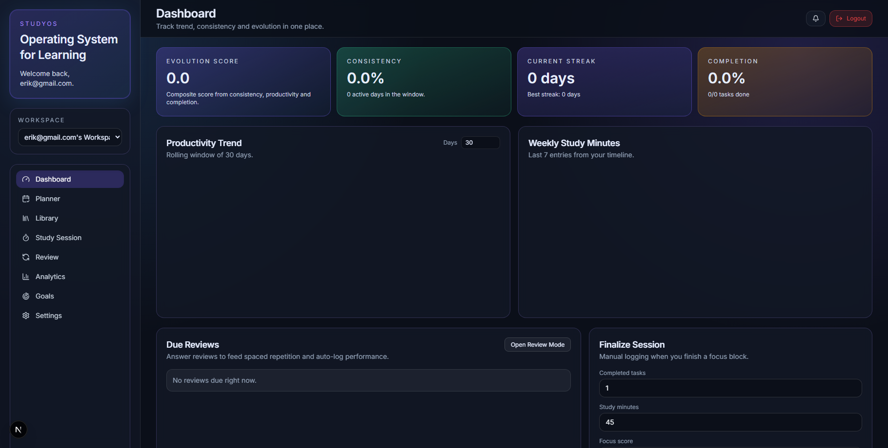
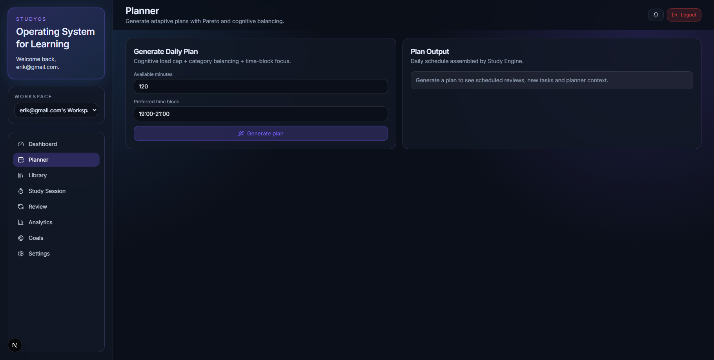
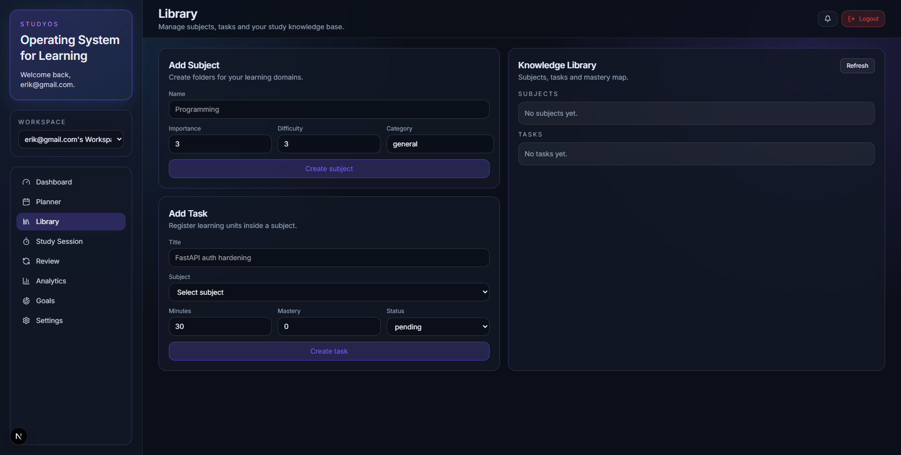
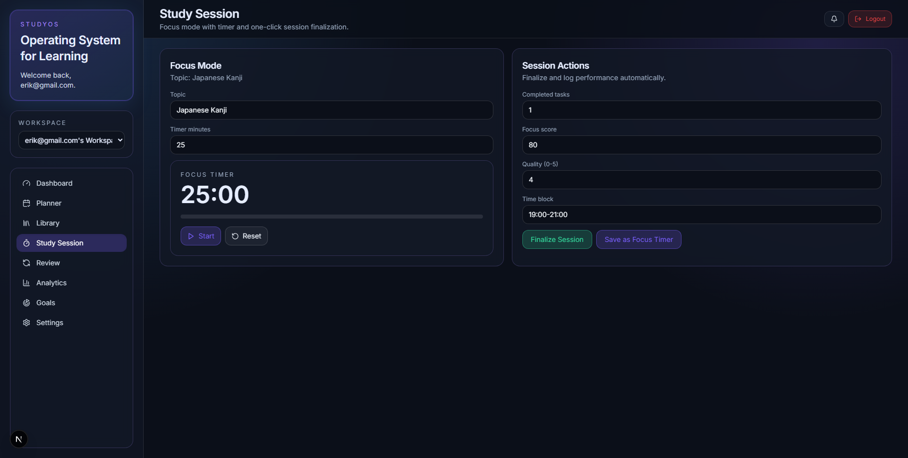
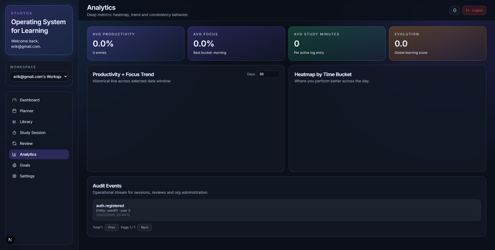
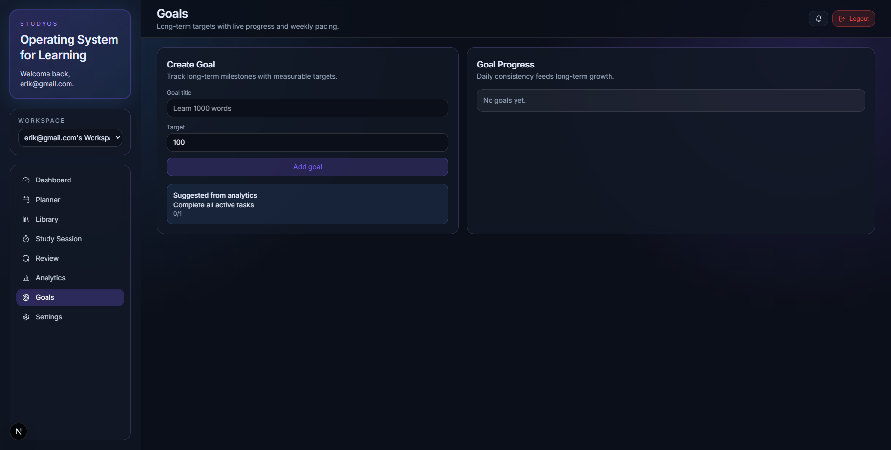
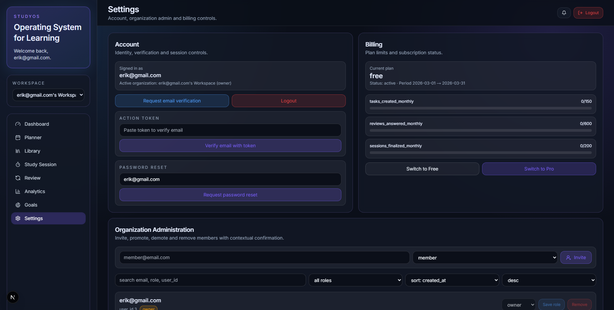

# StudyOS

<p align="center">
  <strong>Adaptive study planning, review workflows, and analytics for modern learners.</strong>
</p>

<p align="center">
  SaaS em construcao com foco em produtividade academica, multi-tenant foundation e operacao pronta para escalar.
</p>

<p align="center">
  
  
  
  
  
</p>

---

## Why StudyOS

StudyOS is being built as a focused learning operating system:

- organize subjects, tasks, and sessions in one workflow
- generate adaptive plans based on available study time
- run review loops with spaced repetition
- capture analytics from real study behavior
- support multi-tenant SaaS growth from the start

The current codebase is already structured like a product, not a prototype throwaway.

## Current Product Status

StudyOS is in the "SaaS in construction" phase.

- Core auth is live with refresh token rotation, logout, email verification, and password reset.
- Multi-tenant foundations are implemented through organizations and memberships.
- Study workflows already connect planner, reviews, sessions, and analytics.
- Local developer experience is automated with scripts, migrations, and health checks.
- Deployment flow is aligned for Railway on the backend and Vercel on the frontend.

## Product Preview

<p align="center">
  Live UI snapshots captured from the current build.
</p>

<p align="center">
  
</p>

<table>
  <tr>
    <td width="50%">
      
      <p><strong>Planner</strong><br />Generate adaptive daily plans with cognitive balancing and time-block focus.</p>
    </td>
    <td width="50%">
      
      <p><strong>Library</strong><br />Manage subjects, tasks and the learning knowledge base.</p>
    </td>
  </tr>
  <tr>
    <td width="50%">
      
      <p><strong>Study Session</strong><br />Run focus blocks and finalize sessions directly into analytics.</p>
    </td>
    <td width="50%">
      
      <p><strong>Analytics</strong><br />Track trends, heatmaps, audit events and consistency metrics.</p>
    </td>
  </tr>
  <tr>
    <td width="50%">
      
      <p><strong>Goals</strong><br />Create long-term targets and connect progress to study behavior.</p>
    </td>
    <td width="50%">
      
      <p><strong>Settings</strong><br />Control account actions, billing and organization administration.</p>
    </td>
  </tr>
</table>

To regenerate these screenshots locally:

```bash
cd frontend
npm run capture:readme
```

## Platform Snapshot

| Layer | Stack | Notes |
| --- | --- | --- |
| Frontend | Next.js 15, React 18 | App Router, auth flows, dashboard, planner, review, analytics |
| Backend | FastAPI, SQLAlchemy, Alembic | JWT auth, multi-tenant APIs, rate limiting, email actions |
| Database | PostgreSQL | Local via Docker Compose, production via Railway |
| Testing | Pytest, Playwright | Backend validation plus E2E auth and workflow coverage |
| Operations | Railway, Vercel | Environment-based deploys, migration-aware startup |

## What Already Works

- register and login with rotating refresh token sessions
- email verification and password reset flows
- personal workspace provisioning during signup
- organization-aware access control through `X-Organization-Id`
- CRUD for study entities and adaptive planner routes
- review answers feeding session finalization and analytics
- SaaS-oriented deployment docs, staging runbook, and production readiness checklist

## Architecture

```text
StudyOS
|- frontend/   Next.js application
|- backend/    FastAPI API, models, services, migrations
|- scripts     Local startup and shutdown helpers
|- docs        Deployment and operational references
```

Core runtime flow:

1. Frontend authenticates against the FastAPI backend.
2. Backend provisions and scopes data per organization.
3. Study actions generate analytics and operational events.
4. Railway runs the API and migrations, while Vercel serves the product UI.

## Local URLs

- Frontend: `http://127.0.0.1:3000`
- Backend: `http://127.0.0.1:8080`
- Healthcheck: `http://127.0.0.1:8080/health`
- PostgreSQL via Docker Compose: `127.0.0.1:5433`

## Quick Start

The fastest path is the automated local stack:

```powershell
.\start-prod-local.ps1
```

What the script does:

- checks whether Docker Desktop is available
- starts the local Postgres service
- applies Alembic migrations
- starts the API and worker processes
- waits until `GET /health` responds successfully

Useful commands:

```powershell
.\start-prod-local.ps1 -ForceRestart
.\stop-prod-local.ps1
```

## Manual Setup

### Backend

```bash
cd backend
python -m venv .venv
.venv\Scripts\activate
pip install -r requirements.txt
copy .env.example .env
python -m alembic upgrade head
python -m uvicorn app.main:app --reload --host 127.0.0.1 --port 8080
```

### Frontend

```bash
cd frontend
copy .env.example .env.local
npm install
npm run dev
```

`frontend/.env.example` already targets the local API on `http://127.0.0.1:8080`.

## Testing

### Backend

```bash
cd backend
python -m pytest -q
```

### Frontend E2E

```bash
cd frontend
npx playwright install chromium
npm run test:e2e
```

The current automated coverage already exercises:

- auth register/login flows
- token refresh and logout scenarios
- study session completion
- review answer workflow
- organization member administration

## Deploy

StudyOS is structured for:

- Railway on the backend
- Vercel on the frontend

Start here:

- [DEPLOYMENT.md](DEPLOYMENT.md)
- [backend/README.md](backend/README.md)
- [frontend/README.md](frontend/README.md)

Operational references:

- [RUNBOOK_STAGING.md](RUNBOOK_STAGING.md)
- [PRODUCTION_READINESS_CHECKLIST.md](PRODUCTION_READINESS_CHECKLIST.md)

## Product Direction

The project is already moving beyond MVP toward a more complete SaaS foundation.

Current focus:

- stable auth and workspace onboarding
- multi-tenant data model and organization scoping
- analytics-driven study experience
- cleaner deployment and operational discipline

Next layers:

- stronger billing and plan enforcement
- richer observability and incident response
- more mature CI/CD and backup strategy
- AI-assisted planning with reliable fallback behavior

## Repository Guide

- [backend/README.md](backend/README.md): API setup, endpoints, and backend defaults
- [frontend/README.md](frontend/README.md): frontend setup, env behavior, and E2E notes
- [DEPLOYMENT.md](DEPLOYMENT.md): Railway and Vercel configuration
- [RUNBOOK_STAGING.md](RUNBOOK_STAGING.md): incident handling for staging and deploy issues
- [PRODUCTION_READINESS_CHECKLIST.md](PRODUCTION_READINESS_CHECKLIST.md): maturity backlog toward public production

## Positioning

StudyOS is not being built as a static study tracker.
It is being shaped as a learning SaaS platform with product foundations, operational discipline, and room to evolve into a serious academic productivity product.
